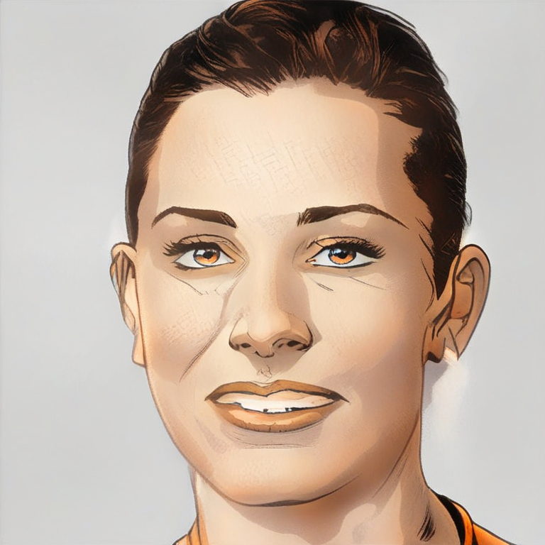
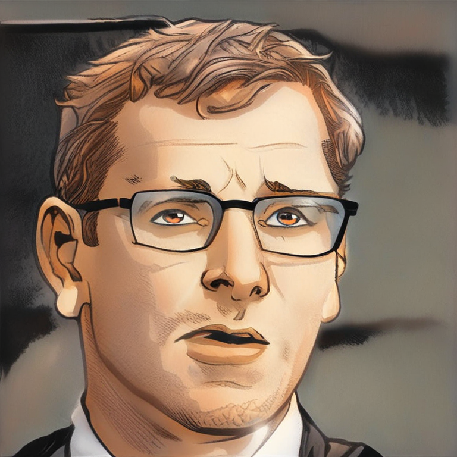
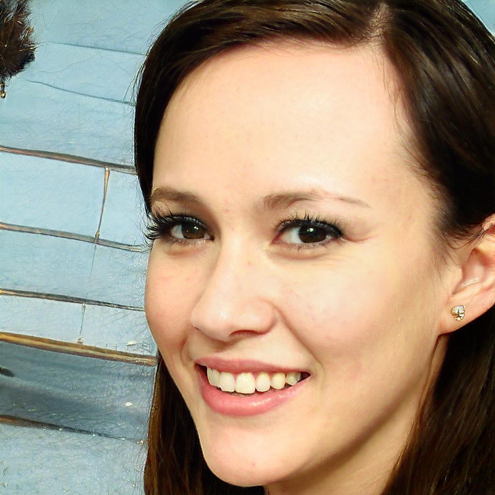
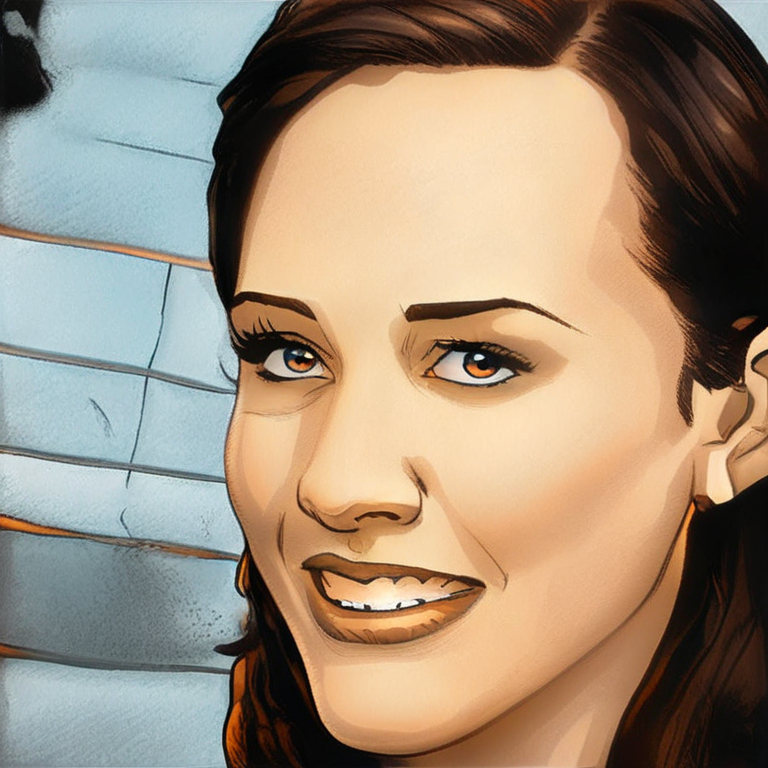
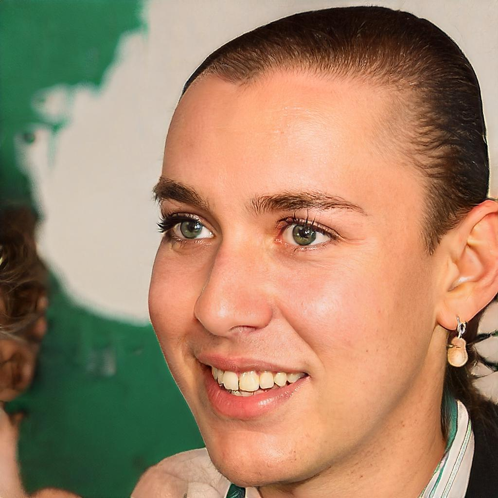
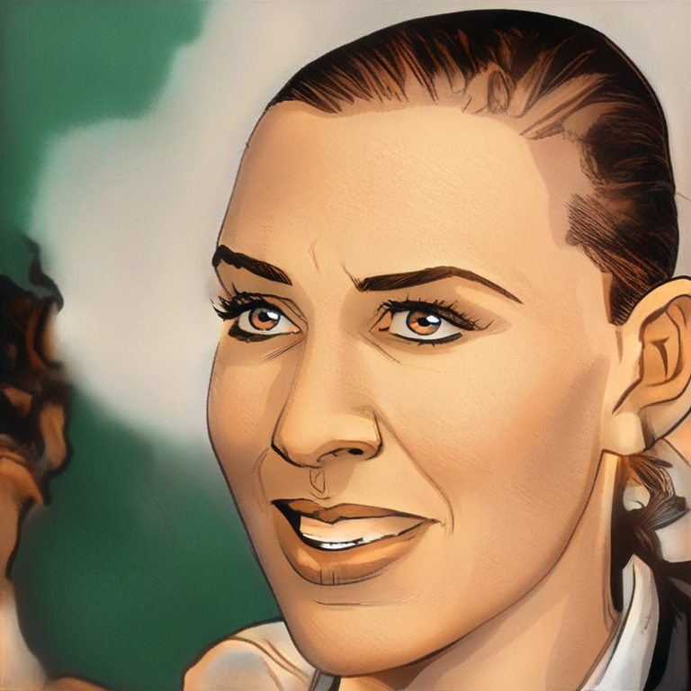
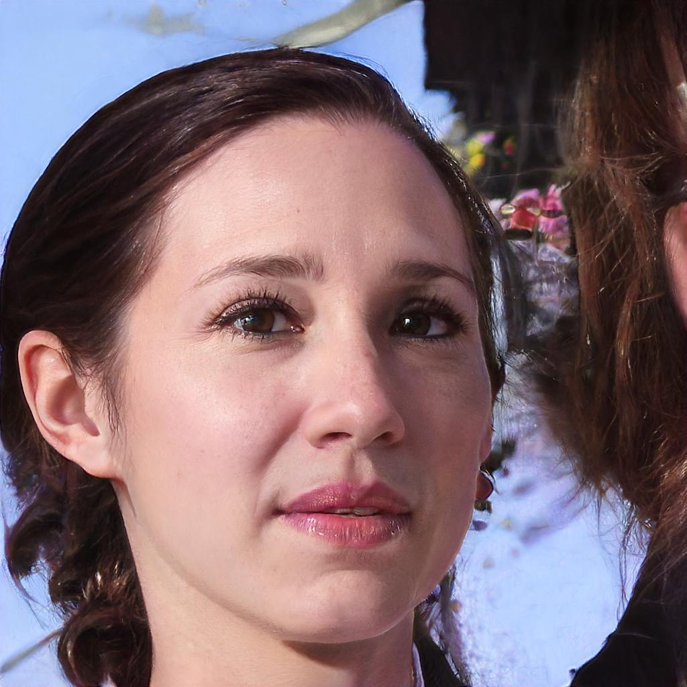
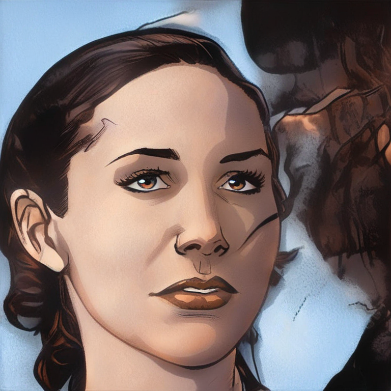

# Realistic Image to Comic Style Translation

**SDXL + LoRA Fine-Tuning for Image-to-Image Domain Adaptation**

> Convert realistic face photographs into modern western comic-book artwork using Stable Diffusion XL with a custom-trained LoRA adapter.

---

## Table of Contents

1. [Project Overview](#1-project-overview)
2. [Problem Statement](#2-problem-statement)
3. [Dataset](#3-dataset)
4. [Dataset Limitation](#4-dataset-limitation)
5. [Model Selection](#5-model-selection)
6. [SDXL Architecture](#6-sdxl-architecture)
7. [Why Img2Img](#7-why-img2img)
8. [Why LoRA](#8-why-lora)
9. [Training Configuration](#9-training-configuration)
10. [Experiment Design](#10-experiment-design)
11. [Validation](#11-validation)
12. [Evaluation Methodology](#12-evaluation-methodology)
13. [Final Results](#13-final-results)
14. [Qualitative Results](#14-qualitative-results)
15. [Inference Pipeline](#15-inference-pipeline)
16. [Gradio Demo](#16-gradio-demo)
17. [Performance Benchmark](#17-performance-benchmark)
18. [Production Architecture](#18-production-architecture)
19. [Monitoring](#19-monitoring)
20. [Limitations](#20-limitations)
21. [Future Work](#21-future-work)
22. [Setup Instructions](#22-setup-instructions)
23. [Repository Structure](#23-repository-structure)

---

## 1. Project Overview

This project implements an end-to-end pipeline for translating realistic face images into comic-book style illustrations. The system uses **Stable Diffusion XL (SDXL) 1.0** as the base model with a **LoRA (Low-Rank Adaptation) adapter** fine-tuned on 480 paired face-to-comic examples.

The final model achieves significant improvements over the base SDXL baseline across all three evaluation metrics on 60 unseen test pairs:

| Metric | Improvement |
|---|---|
| LPIPS | **12.03% lower** (better perceptual similarity) |
| SSIM | **2.59% higher** (better structural similarity) |
| CLIP | **26.43% higher** (better semantic alignment) |

---

## 2. Problem Statement

**Task:** Given a realistic face photograph, generate a high-quality comic-book style illustration that:

- Preserves the subject's facial identity and expression
- Applies consistent modern western comic-book art style
- Produces clean linework, vibrant colors, and cel shading
- Maintains structural coherence with the input image

**Approach:** Fine-tune a pre-trained image generation model using paired examples of realistic faces and their comic counterparts, then deploy the model through an interactive demo.

---

## 3. Dataset

**Source:** Comic Faces (paired, synthetic) v2 — Face2Comics v2.0.0 by Sxela

| Split | Pairs |
|---|---:|
| Train | 480 |
| Validation | 60 |
| Test | 60 |
| **Total** | **600** |

**Seed:** 42

### Data Preparation

- Matched input (face) and target (comic) files by identical filenames
- Converted all images to RGB
- Standardized output to PNG format
- Removed unmatched files

### Augmentation

- Random horizontal flip (training only)
- Center crop
- Resize to 768 × 768

See [`data/DATASET.md`](data/DATASET.md) for full documentation.

---

## 4. Dataset Limitation

> **Important:** The original assignment requested paired Marvel movie-to-comic images. An approved paired realistic-face-to-comic dataset was used as a proxy because an appropriate paired Marvel dataset was not available. Therefore, the current model demonstrates **realistic-face-to-comic domain adaptation** rather than Marvel-specific character conversion.

The proxy dataset is a paired image translation dataset rather than a class-based classification dataset. Conventional class distribution metrics are therefore not applicable.

---

## 5. Model Selection

| Criterion | Choice | Rationale |
|---|---|---|
| Base model | SDXL 1.0 | State-of-the-art image quality, 1024px native resolution |
| Pipeline | Img2Img | Preserves input structure for identity retention |
| Adaptation | LoRA | Parameter-efficient, ~23 MB adapter vs 6.9 GB full model |
| Precision | FP16 | 50% VRAM reduction with negligible quality loss |

### Advantages

- SDXL produces photorealistic outputs with fine detail
- Img2Img pipeline naturally preserves facial structure
- LoRA allows fine-tuning with limited data and compute
- The full base model remains frozen (generalizes well)

### Limitations

- SDXL is computationally expensive (~14 seconds per image)
- Limited to the visual style learned from 480 training examples
- Identity preservation depends on the strength parameter

### Computational Requirements

- **Training:** 2 GPUs with ≥16 GB VRAM each
- **Inference:** 1 GPU with ≥6 GB VRAM
- **Storage:** ~7 GB for base model + 23 MB for LoRA

---

## 6. SDXL Architecture

Stable Diffusion XL is a latent diffusion model with:

- **UNet:** 2.6B parameter denoising network
- **Text Encoders:** Dual CLIP ViT-L + OpenCLIP ViT-bigG
- **VAE:** Image ↔ latent space conversion
- **Scheduler:** Controls the denoising schedule

The model operates in latent space (64× spatial compression), making it efficient for high-resolution generation.

See [`docs/architecture.md`](docs/architecture.md) for detailed diagrams.

---

## 7. Why Img2Img

Unlike text-to-image generation, **Img2Img** takes an existing image as input:

1. Encodes the input image to latent space
2. Adds noise proportional to `strength` (0.45 = 45% noise)
3. Denoises from the partially noised latent
4. Preserves structural information from the input

This is critical for **identity preservation** — the model translates style while retaining facial geometry, pose, and expression from the input photograph.

---

## 8. Why LoRA

Full fine-tuning of SDXL (3.5B parameters) is impractical on consumer or cloud GPUs. **LoRA (Low-Rank Adaptation)** adds small trainable matrices to the attention layers:

```
Original weight: W (frozen, full rank)
LoRA matrices:   A (low rank r) × B (low rank r)
Effective:       W + A × B
```

**Benefits:**
- Only ~23 MB of trainable parameters
- Base model stays frozen (no catastrophic forgetting)
- Fast training (500 steps vs thousands for full fine-tuning)
- Easy to share and version (small file)

---

## 9. Training Configuration

| Parameter | Value |
|---|---|
| Base model | SDXL 1.0 |
| Resolution | 768 × 768 |
| Training examples | 480 |
| Batch size per GPU | 1 |
| Gradient accumulation | 4 |
| Effective batch size | 8 (2 GPUs × 1 × 4) |
| Learning rate | 1e-4 |
| Scheduler | Constant |
| Optimizer | 8-bit Adam |
| Mixed precision | FP16 |
| Training steps | 500 |
| GPUs | 2 (NCCL distributed) |
| Seed | 42 |

See [`configs/training_config.yaml`](configs/training_config.yaml) for the full configuration and [`training/README.md`](training/README.md) for design decision rationale.

---

## 10. Experiment Design

```
600 paired images (Face2Comics v2)
         │
         ▼
480 / 60 / 60 split (seed=42)
         │
         ▼
Base SDXL Img2Img (baseline)
         │
         ▼
LoRA fine-tuning (2 GPUs, 500 steps)
         │
         ▼
LoRA-500 adapter
         │
    ┌────┴────┐
    ▼         ▼
Quantitative  Qualitative
Evaluation    Evaluation
    │         │
    └────┬────┘
         ▼
   Final Model
         │
         ▼
   Gradio Demo
         │
         ▼
Production Design
```

The training used **distributed multi-GPU training** with NCCL backend. The training log confirms 2 processes (rank 0 on `cuda:0`, rank 1 on `cuda:1`), 480 training examples, a distributed batch size of 8, and 500 optimization steps.

---

## 11. Validation

The validation experiment compared Base SDXL, LoRA-250, and LoRA-500 on 60 validation pairs:

| Model | LPIPS ↓ | SSIM ↑ | CLIP ↑ |
|---|---:|---:|---:|
| Base SDXL | 0.630068 | 0.402745 | 0.642062 |
| LoRA-250 | 0.569183 | 0.413175 | 0.769644 |
| **LoRA-500** | **0.564496** | **0.413928** | **0.817197** |

LoRA-500 was selected as the final model checkpoint based on consistent improvement across all metrics.

---

## 12. Evaluation Methodology

### Quantitative Metrics

| Metric | What it Measures | Direction |
|---|---|---|
| **LPIPS** | Perceptual similarity (AlexNet features) | Lower = better |
| **SSIM** | Structural similarity (luminance, contrast, structure) | Higher = better |
| **CLIP** | Semantic/image-domain alignment (ViT-B/32) | Higher = better |

### FID

FID (Fréchet Inception Distance) was planned as an additional metric but could not be reliably executed in the Kaggle environment due to a Torch-Fidelity dependency incompatibility. No FID number is reported rather than reporting an unreliable score.

### Identity Preservation

Automated face recognition was investigated but produced limited reliable face detections on stylized comic outputs. Comic-style faces frequently fail standard face detection models.

Identity preservation is therefore treated as a supplementary qualitative evaluation rather than a primary quantitative metric.

### Qualitative Evaluation

- Character consistency across different inputs
- Style consistency (linework, coloring, shading)
- Visual quality and artifact detection
- Prompt adherence

See [`evaluation/README.md`](evaluation/README.md) for full details.

---

## 13. Final Results

Evaluated on **60 unseen test pairs**:

| Model | LPIPS ↓ | SSIM ↑ | CLIP ↑ |
|---|---:|---:|---:|
| Base SDXL | 0.639657 | 0.404214 | 0.649730 |
| **SDXL + LoRA-500 (2 GPU)** | **0.562685** | **0.414692** | **0.821407** |

### Improvement

| Metric | Improvement |
|---|---:|
| LPIPS | 12.03% lower |
| SSIM | 2.59% higher |
| CLIP | **26.43% higher** |

The CLIP improvement is particularly significant — the fine-tuned model produces outputs that are substantially more aligned with the target comic domain compared to the base SDXL model.

---

## 14. Qualitative Results

Example conversions from the test set (selected by best composite metric scores):

| Input (Realistic) | Output (Comic) |
|---|---|
|  |  |
|  |  |
|  |  |
|  |  |
|  |  |

The full comparison figure is available at [`results/final_comparison.png`](results/final_comparison.png).

---

## 15. Inference Pipeline

```
Input Image
     ↓
RGB Conversion
     ↓
768×768 Resize
     ↓
Latent Encoding (VAE)
     ↓
Noise Addition (strength=0.45)
     ↓
Diffusion Denoising (20 steps)
  + LoRA Adaptation
  + Text Conditioning
  + Classifier-Free Guidance (scale=7)
     ↓
VAE Decode
     ↓
Comic Output (768×768 RGB)
```

The inference pipeline is implemented in [`inference/pipeline.py`](inference/pipeline.py) as the `ComicPipeline` class, which is used by:

- `app.py` — Gradio web interface
- `scripts/run_inference.py` — CLI inference
- `scripts/benchmark.py` — Performance benchmarking

---

## 16. Gradio Demo

The interactive demo allows users to:

1. Upload a realistic face image
2. Adjust generation parameters (strength, guidance, steps, seed)
3. Generate comic-style output

### Default Parameters

| Parameter | Value |
|---|---|
| Style Strength | 0.45 |
| Guidance Scale | 7.0 |
| Inference Steps | 20 |
| Seed | 42 |

### Running the Demo

```bash
python app.py
```

The demo will be available at `http://localhost:7860`.

---

## 17. Performance Benchmark

| Metric | Value |
|---|---|
| Resolution | 768 × 768 |
| Precision | FP16 |
| Inference Steps | 20 |
| Latency | **13.85 seconds/image** |
| Peak Allocated VRAM | 5.81 GB |
| Peak Reserved VRAM | 6.18 GB |

Run your own benchmark:

```bash
python scripts/benchmark.py
```

---

## 18. Production Architecture

### Serving Options

| Option | Best For |
|---|---|
| Hugging Face Spaces | Demo / portfolio |
| Docker + GPU instance | Production API |
| Serverless GPU (Modal, Replicate) | Pay-per-use |

### GPU Requirements

| Component | Minimum | Recommended |
|---|---|---|
| GPU VRAM | 6 GB | 8+ GB |
| GPU Type | T4 | A10G / A100 |
| System RAM | 16 GB | 32 GB |

### Optimizations Implemented

- ✅ FP16 inference
- ✅ CPU offloading for model layers
- ✅ VAE slicing and tiling
- ✅ Single model load for multiple requests

### Cost Estimation

```
Cost/image = GPU hourly rate × (13.85 / 3600) hours
```

| GPU | Rate | Cost/Image |
|---|---:|---:|
| T4 (spot) | $0.35/hr | ~$0.001 |
| T4 (on-demand) | $1.00/hr | ~$0.004 |
| A10G | $1.50/hr | ~$0.006 |

See [`docs/deployment.md`](docs/deployment.md) for the full production guide.

---

## 19. Monitoring

### Key Metrics to Track

| Metric | Target | Alert |
|---|---|---|
| Inference latency | <15s | >30s |
| GPU utilization | >80% | <10% |
| VRAM usage | <6 GB | >7.5 GB |
| Error rate | <1% | >5% |

### Logging

Each inference request should log:
- Timestamp, latency, parameters, success/failure status
- GPU memory usage at inference time
- Input image dimensions

---

## 20. Limitations

1. **Dataset proxy:** The model was trained on a general face-to-comic dataset, not Marvel-specific paired data. Results demonstrate domain adaptation capability rather than character-specific conversion.

2. **Identity preservation:** At higher strength values (>0.6), facial identity may diverge from the input. The default strength of 0.45 balances style transfer and identity retention.

3. **Single style:** The model learned one comic style from the training data. It does not support multiple artistic styles without retraining.

4. **Resolution:** Fixed at 768 × 768. Higher resolutions require proportionally more VRAM and compute.

5. **Inference speed:** ~14 seconds per image on a single GPU. Not suitable for real-time applications without further optimization.

6. **Face detection on outputs:** Standard face detection models have limited coverage on comic-style outputs, making automated identity metrics unreliable.

---

## 21. Future Work

| Priority | Item | Impact |
|---|---|---|
| High | TensorRT / ONNX compilation | 2-4× inference speedup |
| High | INT8 quantization | Further VRAM reduction |
| Medium | LoRA merging into base weights | Eliminate adapter overhead |
| Medium | Multi-style training | Support multiple comic art styles |
| Medium | Higher resolution support | 1024 × 1024 generation |
| Low | Marvel-specific dataset | Original assignment scope |
| Low | Video style transfer | Frame-by-frame consistency |
| Low | FID evaluation | Complete metric suite |

---

## 22. Setup Instructions

### Prerequisites

- Python 3.10+
- NVIDIA GPU with ≥6 GB VRAM
- CUDA toolkit installed

### Installation

```bash
# Clone the repository
git clone https://github.com/YOUR_USERNAME/comic-image-translation.git
cd comic-image-translation

# Create virtual environment
python -m venv .venv
source .venv/bin/activate

# Install PyTorch (select the correct command for your CUDA version)
# See: https://pytorch.org/get-started/locally/
pip install torch torchvision --index-url https://download.pytorch.org/whl/cu121

# Install project dependencies
pip install -r requirements.txt

# Copy environment template
cp .env.example .env
```

### Download the LoRA Model

**Option A — From Hugging Face:**

```bash
python scripts/download_model.py --repo YOUR_USERNAME/comic-sdxl-lora
```

**Option B — Manual:**

Place `comic_sdxl_lora_500.safetensors` in the `models/` directory.

### Run Inference

**Gradio demo:**

```bash
python app.py
```

**CLI:**

```bash
python scripts/run_inference.py \
    --input examples/input_01.png \
    --output outputs/my_comic.png
```

**Benchmark:**

```bash
python scripts/benchmark.py
```

---

## 23. Repository Structure

```
comic-image-translation/
│
├── README.md                    # This file
├── requirements.txt             # Python dependencies
├── .gitignore                   # Git ignore rules
├── .env.example                 # Environment template
├── LICENSE                      # MIT License
│
├── app.py                       # Gradio demo application
│
├── configs/
│   ├── config.yaml              # Inference configuration
│   └── training_config.yaml     # Training configuration
│
├── data/
│   └── DATASET.md               # Dataset documentation
│
├── models/
│   └── comic_sdxl_lora_500.safetensors  # Trained LoRA adapter
│
├── inference/
│   ├── __init__.py
│   └── pipeline.py              # ComicPipeline class
│
├── training/
│   ├── __init__.py
│   ├── train_lora.py            # Reproducible training script
│   └── README.md                # Training documentation
│
├── evaluation/
│   ├── __init__.py
│   ├── metrics.py               # LPIPS, SSIM, CLIP metrics
│   ├── evaluate.py              # Evaluation runner
│   └── README.md                # Evaluation documentation
│
├── results/
│   ├── final_results.csv        # Summary metrics
│   ├── validation_results.csv   # Validation comparison
│   ├── benchmark.txt            # Latency & VRAM
│   └── final_comparison.png     # Visual comparison
│
├── examples/
│   ├── input_01.png ... input_05.png    # Example inputs
│   └── output_01.png ... output_05.png  # Example outputs
│
├── notebooks/
│   └── final_experiment.ipynb   # Kaggle experiment notebook
│
├── docs/
│   ├── architecture.md          # System architecture
│   ├── deployment.md            # Production deployment guide
│   └── metadata.csv             # Dataset metadata
│
└── scripts/
    ├── run_inference.py         # CLI inference
    ├── benchmark.py             # Performance benchmark
    ├── download_model.py        # Model downloader
    └── setup_training_repo.py   # Clone Diffusers for training
```

---

## License

This project is licensed under the MIT License — see the [LICENSE](LICENSE) file for details.

## Acknowledgments

- [Stability AI](https://stability.ai/) — SDXL 1.0 base model
- [Hugging Face](https://huggingface.co/) — Diffusers, Transformers, Accelerate, PEFT
- [Face2Comics](https://www.kaggle.com/) — Paired face-to-comic dataset
- [OpenAI](https://openai.com/) — CLIP model for evaluation
